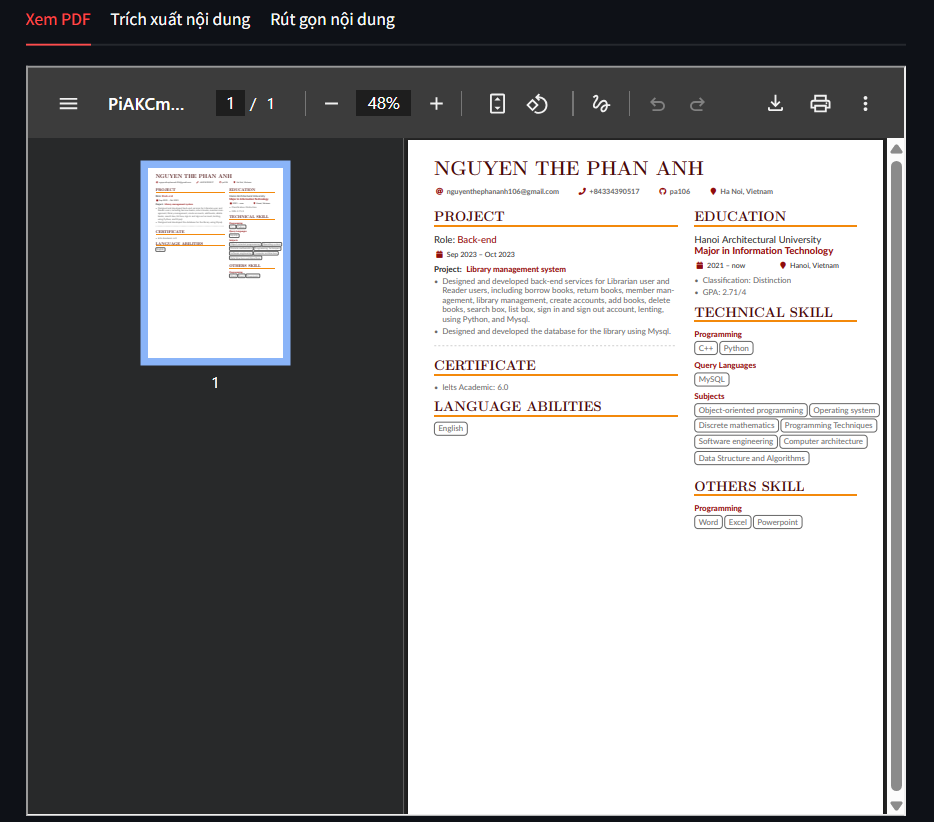
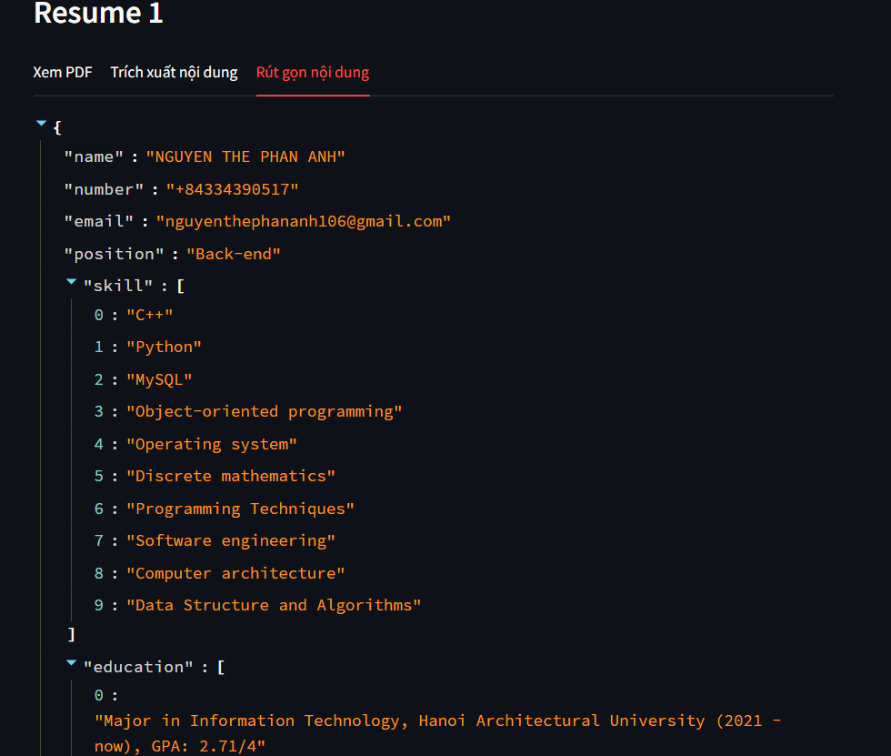
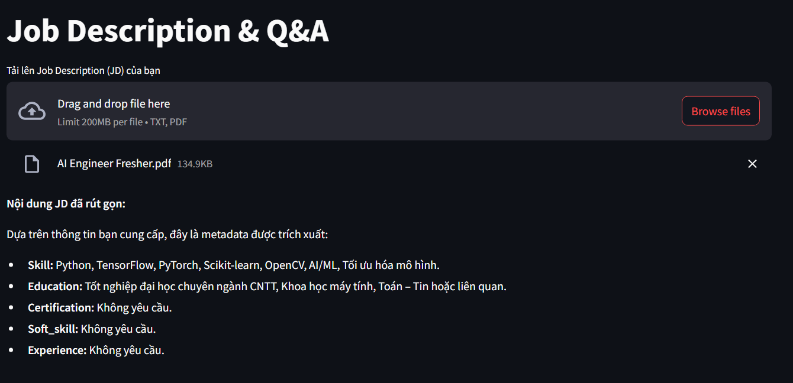
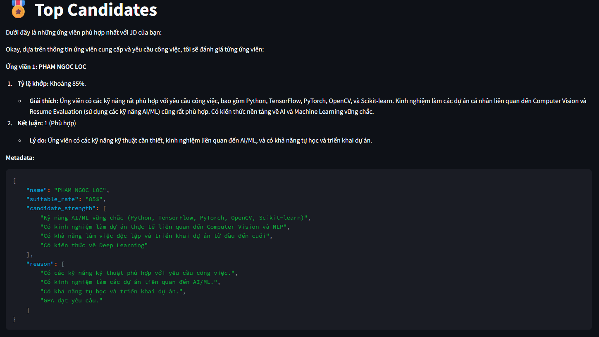

# 📄 Resume Screening with LLM

This project is a Resume Evaluation web application built with **Streamlit**, utilizing **NLP**, **PDF parsing**, and **semantic similarity** techniques. It extracts structured data from PDF resumes and evaluates how well a candidate’s profile matches a specific job role (e.g., Web Developer, Data Scientist, etc.).

---

## 🚀 Features

- 📄 Read and clean raw text data from uploaded PDF resume files and job descriptions
- 🧠 Summarize resume content and job description using Gemini 2.0 flash. embedding summarization resume with bkai-foundation-models/vietnamese-bi-encoder model from HuggingFace and store the results in a vector database
- 📊 Evaluate and identify suitable resumes for a given job description by retrieving relevant resume information using RAG (Retrieval-Augmented Generation) techniques. Then, use Gemini to analyze the retrieved content and generate a final assessment of the most suitable candidates.
- 🔎Rank the top matching resumes for the recruiter based on their relevance to the job description
- 🖥️ User-friendly Streamlit interface for uploading and viewing analysis results

---

## 🛠️ Tech Stack

- Python
- Streamlit
- langchain
- HuggingFace

---
## Extract Candidate Information




## Evaluate Candidate




> **Note:**  
> To run this application, you must provide your Google API key.  
> Please add your `GOOGLE_API_KEY` to a `.env` file in the project root directory:
>
> ```
> GOOGLE_API_KEY=your_google_api_key_here
> ```